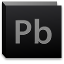

# Photo Brush Studio Project 

Photo Brush Studio project using C# and GDI+ in 4.0 framework envirement in Windows 8, Photo Brush an image editing tools look like Adobe Photoshop this tool provide many kinds of images such as JPG, PNG, GIF, PSD, and PBP own binary file.

## Installation Requirements
- Microsoft Visual Studio 2010 or newer
- Microsoft Framework 4.0 version
- Microsoft Windows Operation System Vista/7/8 or newer

## Design Patterns
- Singleton
- Builder
- Bridge
- Strategy
- Prototype

## Code and Features
Photo Brush Studio project used techniques
- Windows Form Application on Microsoft Visual Studio 2010, User Controls, Component Classes, Design compatible with Windows 8 operating system.
- Unsafe Technique for image filtering and [AForge. NET Framework](http://www.aforgenet.com/)  
- GDI+ for painting 
- Docking Window
- Animation Library 
- PSD Framework

## License
Photo Brush Studio project licensed under [MIT](http://opensource.org/licenses/MIT) license.

## Acknowledgements
Many thanks to [AForge. NET Framework](http://www.aforgenet.com/) for their support on Filter and many libraries as well as [Code Project](http://www.codeproject.com), [C Sharp Corner](http://www.c-sharpcorner.com/), and Microsoft.

## Dedication
This report is the result of our graduation project for the bachelor’s degree in Information Technology engineering at Faculty of Engineering at the University Of Kalamoon.
We would like to express our job to Dr. Mohamed Hajji, Dr. Anton Ghnim, Dr. Monssef Alsweis, Dr. Rami Yared, Eng. Ahmad Osman, and Eng. Muaz Othman for his priceless advice, support and contribution that he made during our work on this project, special thanks to all other instructors for their efforts in teaching us what we utilized in this project and will utilize in future project.
